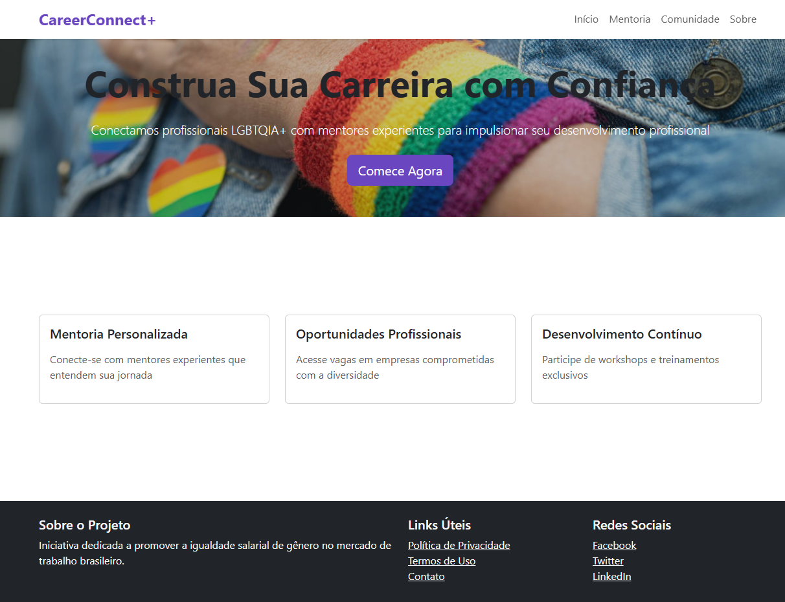

# CareerConnect+

Plataforma de mentoria e desenvolvimento profissional voltada para a comunidade LGBTQIA+.



## 🚀 Funcionalidades

- Conexão com mentores experientes
- Portal de vagas em empresas inclusivas
- Comunidade de networking
- Desenvolvimento profissional

## 🛠️ Tecnologias

- HTML5
- CSS3
- Bootstrap 5
- JavaScript

## 📁 Estrutura do Projeto

```
/careerconnect
├── css/
│   └── style.css
├── pages/
│   ├── mentoria.html
│   ├── comunidade.html
│   └── sobre.html
├── database/
│   ├── modelo-conceitual.png
│   ├── modelo-logico.png
│   └── script.sql
└── index.html
```

## 🔧 Instalação

1. Clone o repositório

```bash
git clone https://github.com/seu-usuario/careerconnect.git
```

2. Abra o arquivo index.html no navegador

## 📝 Licença

Este projeto está sob a licença MIT.
